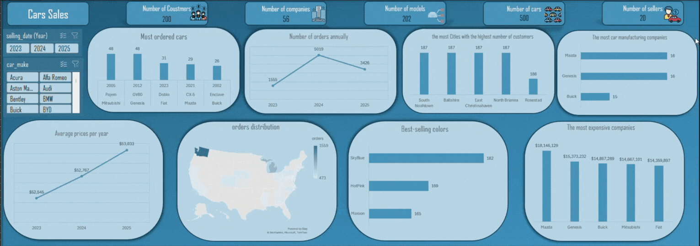

#  Cars sales Data Normalization & Analysis

A data analytics project focused on **normalizing raw car data using SQL**, then performing **analysis and visualization in Excel**.

The project demonstrates a complete workflow from **raw dataset → normalized database → analytical dashboard**.

---

##  Project Overview

This project follows a structured data analysis pipeline:

1. Import raw dataset into SQL database
2. Normalize the data into multiple relational tables
3. Generate IDs and connect tables with references
4. Query the normalized data using **CTEs**
5. Connect SQL database to **Excel via ODBC**
6. Analyze and visualize the results using **Excel dashboards**
---

##  Technologies Used

* SQL (PostgreSQL)
* CTEs (Common Table Expressions)
* Excel
* ODBC Connection
* Data Normalization
* Data Visualization

---

##  Data Normalization

The original dataset contains multiple entities in a single table.

The dataset was normalized into relational tables such as:

* **Sellers**
* **Coustmers**
* **Orders**
* **Cars_data**

Each entity was assigned a **unique ID** and connected through **foreign keys**.

Example:

```
Sellers
--------------
seller_id
seller_name

coustmers
--------------
coustmer_id
coustmer_name

Cars_data
--------------
car_id
car_model
car_year
car_make

orders
--------------
order_id
car_id
seller_id
coustmer_id
price
```

---

##  Database Connection

The SQL database was connected to **Excel using ODBC**, allowing Excel to directly query the normalized data.

Steps:

1. Create ODBC connection
2. Use Excel **Advanced Query**
3. Load SQL query results
4. Build Pivot Tables & Charts

---

## Dashboard Insights

* Orders increased from **1,555 in 2023** to **5,019 in 2024**, then decreased to **3,426 in 2025**.
* The **average car price** increased slightly each year from **$52,545** to **$53,033**.
* The most ordered cars include **Mitsubishi Pajero** and **Genesis GV80**, each with **48 orders**.
* **Mazda** and **Genesis** appear most frequently among the car manufacturing companies.
* Some cities like **South Noalhtown**, **Balshire**, and **East Christinaven** have the highest number of customers.
* **Sky Blue** is the most popular car color, followed by **Hot Pink** and **Maroon**.
* **Mazda** generated the highest total sales value among the companies.

---

##  Dashboard Preview



```

---

##  How to Run

1️⃣ Import `car_data.csv` into your SQL database

2️⃣ Run `normalization.sql` to normalize the dataset

3️⃣ Connect Excel to the database via ODBC

4️⃣ Load the query results into Excel

5️⃣ Use the provided Excel file to explore the dashboard

---

##  Skills Demonstrated

* Data Cleaning
* SQL Data Modeling
* Data Normalization
* CTE Queries
* Database Integration
* Data Visualization

---

💡 **Author:** Ahmed Sherif
Engineering Student | Data Analytics Enthusiast
